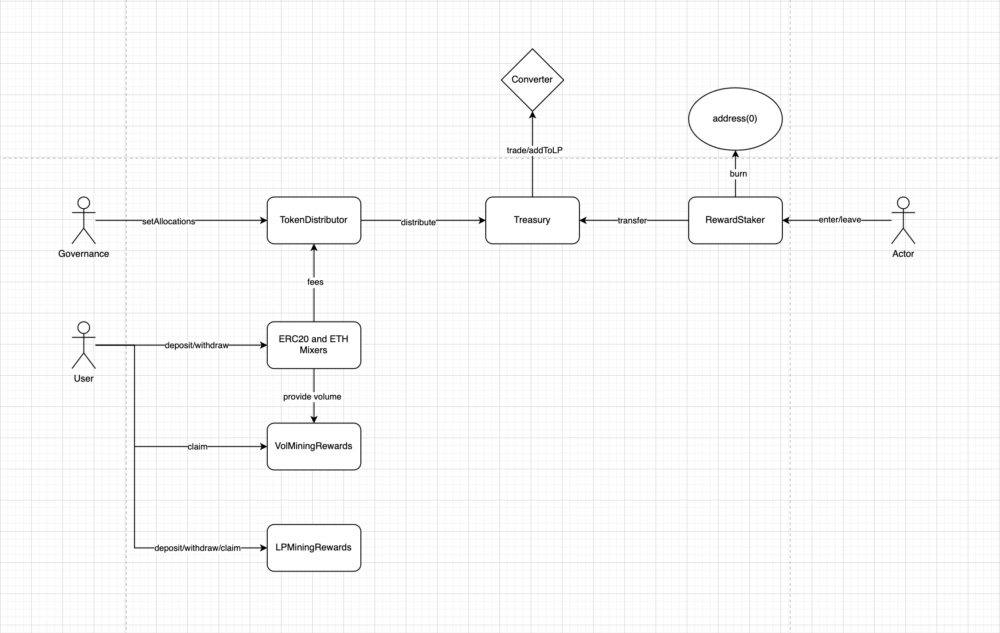

# Deployments

Onion Mixer is a zksnark based token mixing protocol with mining incentivies.

## Rewards

The two main mining mechanism are Volume Mining and LP Mining

### Volume Mining

Volume Mining allows users that mix tokens in the onion mixers to receive OMT rewards proportionaly to their mixing volume.

### LP Mining

LP mining allows users stake their LP tokens (e.g OMT/ETH) to earn more OMT.

### Reward Staker

All mined rewards enter the Reward Staker. Users can choice to exit anytime they wish. Upon exit the following occurs:
- 2% of withdraw amount is burnt.
- 4% is sent to DAO.
- 4% is distributed to the rest of the staking pool.

## DAO

The DAO treasury contract receives token from the mixers and reward staker, and performs buyback and add to LP.

For example, the treasury receives ETH from the ETH mixer. It then sells half of the ETH for OMT, and add to LP.

## Contract Addresses
[address.js](address.js)
